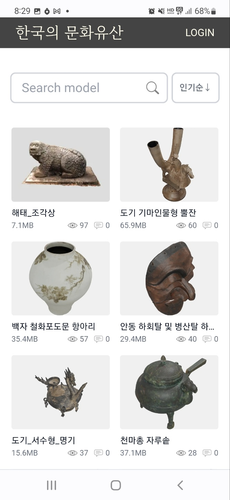

# Poly-Web Immersive Viewer Platform

## Development motive
We want to develop a 3D viewer and AR viewer platform that can view Public Nuri Type 1 data or 3D models with CC0 license on PC web browsers and mobile web browsers.
  

## Service advantages
- Even if you do not install the app in the mobile environment, you can view 3D content using the 3D viewer and AR viewer with a web browser.
- Because it is sometimes inconvenient to visit the site to see real objects in tourism, education, shopping, etc., 3D viewing and AR virtual placement can compensate for these difficulties.
  

## Platform configuration 
1. The main page consists of a list of model objects.
2. Select an object's thumbnail and enter it to view its 3D model and description.
3. On mobile, you can see a real-size object as if you were experiencing it with the AR view function. 
[Cultural Heritage Public Data 3D Content Demo Link](https://www.k-heritage.xyz/models)

 
 

## 3D and AR viewer mobile webpage example
- Pottery equestrian figure type horn cup (Korean cultural heritage public data)  
[3D content demo link](https://www.k-heritage.xyz/models/8662da3f-333f-4646-a67f-a604c28b8d52)   

<!--  -->

 
 

- Earthenware Ordinal Myeonggi (Korean Cultural Heritage Public Data)   
[3D Content Demo Link](https://www.k-heritage.xyz/models/9c2c3e89-53d6-453b-a5f3-fa164f2d5609) 
 

<!--  -->

 

## If you want to install this platform by yourself 
* You can open your own public 3D model platform using this project.
* Please refer to INSTALLATION.md for installation. AWS and S3 Settings are required.
