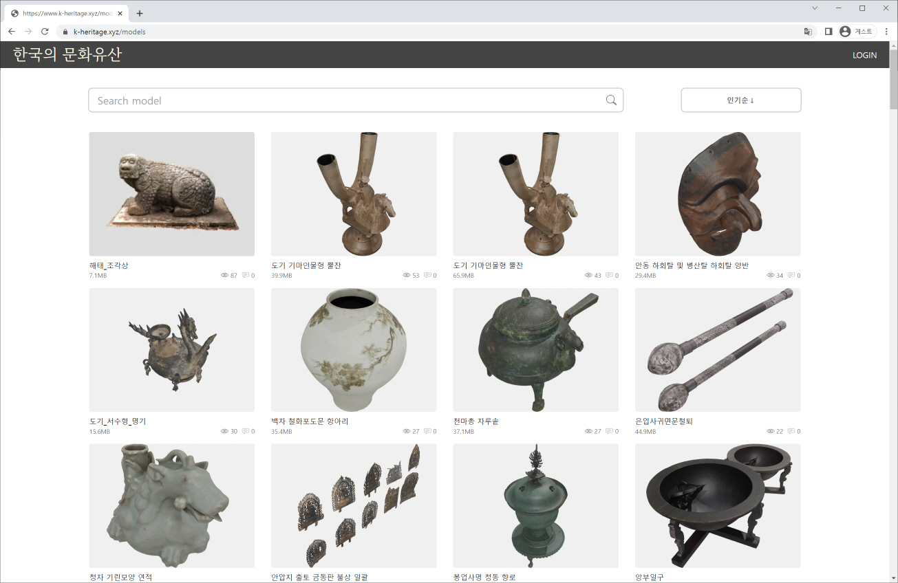
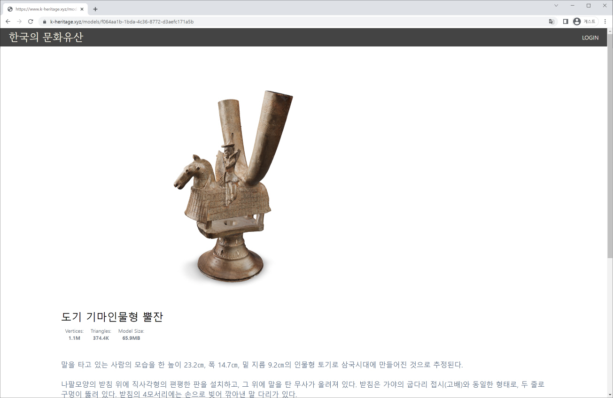
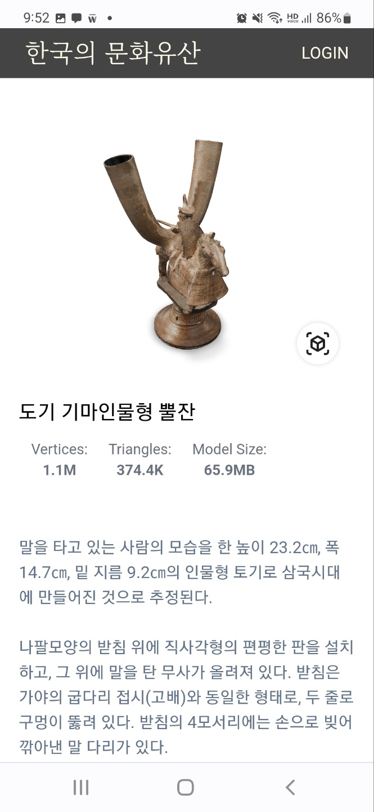
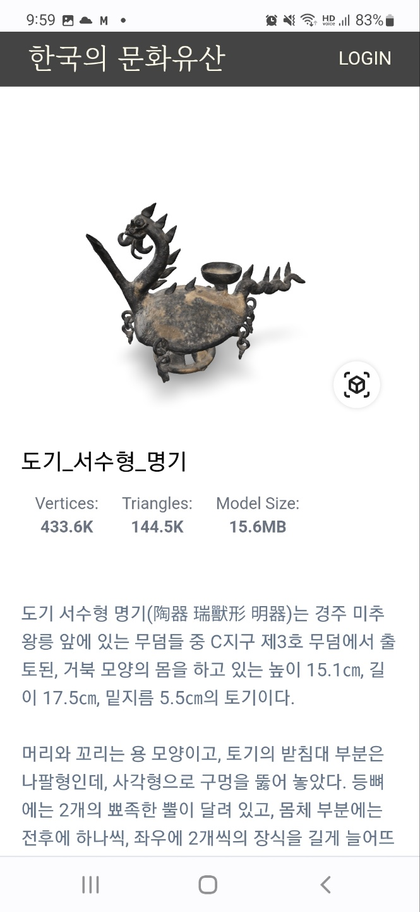
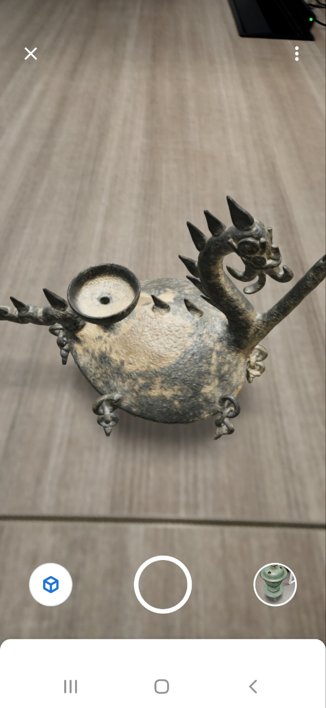

# Poly-Web 실감 뷰어 플랫폼

## 개발 동기
공공 데이터 혹은 CC0 라이선스인 3D 모델들을 수집 및 재구성하여 PC 웹브라우저와 모바일폰에서 쉽게 볼 수 있는 가능한 3D 뷰어 및 AR 뷰어 플랫폼을 개발하고자 합니다.
  

## 서비스 장점
- 앱을 설치하지 않아도, 모바일 웹으로 3D와 AR을 이용할 수 있습니다.
- 관광, 교육, 쇼핑 등에서 실물 오브젝트를 보기위해 현장을 방문하기 불편한 경우가 있기 때문에 3D 보기와 AR 가상 배치로 이러한 어려움을 보완할 수 있습니다.
  

## 플랫폼 구성
1. 메인 화면은 모델 오브젝트의 리스트로 구성되어 있습니다.
2. 오브젝트를 선택해 들어가면 3D 모델과 설명을 볼 수 있습니다.
3. 또한 AR로 보기 기능으로 실감나게 체험하듯이 볼 수 있습니다.

 
 

## 시범 콘텐츠 AR 뷰어 웹페이지
- 해치 석상 (우리나라 문화유산 공공데이터)  
[3D 콘텐츠 데모 링크](https://www.k-heritage.xyz/models/8662da3f-333f-4646-a67f-a604c28b8d52)   

 
 

- 도기 기마인물형 뿔잔 (우리나라 문화유산 공공데이터)   
[3D 콘텐츠 데모 링크](https://www.k-heritage.xyz/models/9c2c3e89-53d6-453b-a5f3-fa164f2d5609) 
 

 

## 별도의 플랫폼을 개설해 이용하고 싶은 경우
* 본 프로젝트 소스코드를 이용하여 별도의 공공 3D 모델 플랫폼을 자체 개설할 수 있습니다. 
* 설치는 INSTALLATION.md를 참고 바랍니다. S3, AWS 등의 셋팅이 필요합니다.
